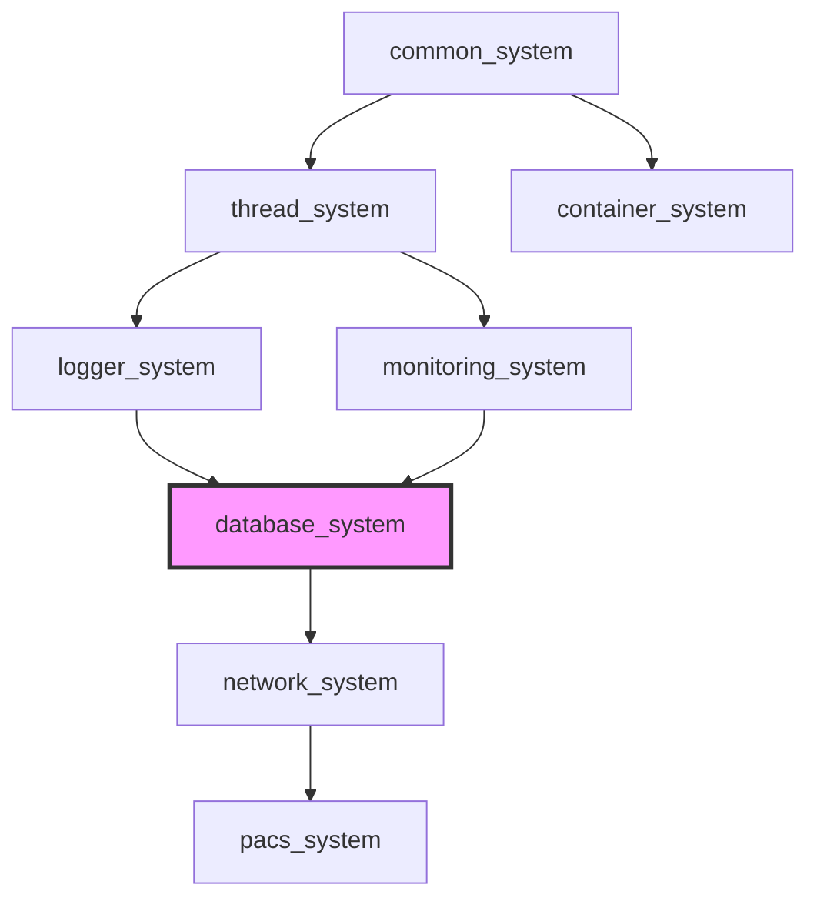

[](https://github.com/kcenon/database_system/actions/workflows/ci.yml)
[](https://github.com/kcenon/database_system/actions/workflows/coverage.yml)
[](https://github.com/kcenon/database_system/actions/workflows/static-analysis.yml)
[](https://codecov.io/gh/kcenon/database_system)
[](https://github.com/kcenon/database_system/actions/workflows/build-Doxygen.yaml)
[](https://github.com/kcenon/database_system/blob/main/LICENSE)

# Database System

> **언어:** [English](README.md) | **한국어**

## 목차

- [개요](#개요)
- [요구사항](#요구사항)
- [핵심 기능](#핵심-기능)
- [성능 하이라이트](#성능-하이라이트)
- [빠른 시작](#빠른-시작)
- [아키텍처 개요](#아키텍처-개요)
- [생태계 통합](#생태계-통합)
- [문서](#문서)
- [CMake 통합](#cmake-통합)
- [프로덕션 품질](#프로덕션-품질)
- [보안 태세](#보안-태세)
- [성능 베이스라인](#성능-베이스라인)
- [기여하기](#기여하기)
- [라이선스](#라이선스)

---

## 개요

ORM 프레임워크, 실시간 성능 모니터링, 엔터프라이즈 보안, 비동기 연산 등 고급 기능을 포함하여 여러 데이터베이스 백엔드에 대한 통합 접근을 제공하는 현대적인 C++20 데이터베이스 추상화 계층입니다.

**핵심 가치 제안**: PostgreSQL, SQLite, MongoDB, Redis를 통합되고 타입 안전한 인터페이스로 지원하는 포괄적인 데이터베이스 솔루션을 통해 벤더 종속을 제거하고, 성능을 극대화하며, 개발을 가속화합니다.

> **연결 모드 상태**:
> - **DirectMode**: 프로덕션 준비 완료 (안정)
> - **ProxyMode**: 스텁 구현 (`database_server` 대기 중, 아직 사용 불가)
>
> 현재 DirectMode가 유일한 프로덕션 옵션입니다. 연결 풀링은 ProxyMode를 통한 서버 측 풀링을 준비하기 위해 로컬에서 제거되었습니다(Phase 4.3). 자세한 내용은 [마이그레이션 가이드](docs/MIGRATION_database_base.md)를 참조하세요. <!-- TODO: dedicated proxy-mode.md migration doc -->

### v1.0.0 릴리스 (2026-04)

- **API 동결**: 모든 동기식 공개 API는 오류 전파에 `Result<T>`를 사용하며, 공개 API 경로에서 `throw`를 사용하지 않습니다.
- **BREAKING**: `builder::build()`는 이제 원시 포인터 대신 `Result<std::unique_ptr<unified_database_system>>`를 반환합니다.
- **BREAKING**: CMake 패키지 이름이 `database_system`으로 통일되었습니다. `find_package(database_system CONFIG REQUIRED)`를 사용하세요.
- **0.x에서의 마이그레이션**: `builder::build()` 호출 지점을 `Result`를 처리하도록 갱신하세요 (자세한 내용은 [CHANGELOG](CHANGELOG.md) 참조).

### 이전 업데이트 (2026-01)

- **C++20 모듈 지원**: 최신 C++20 모듈 임포트를 위한 모듈 파일이 추가되었습니다.
  - 기본 모듈: `kcenon.database`
  - 모듈 파티션: `:core`, `:query`, `:backends`
  - `DATABASE_BUILD_MODULES=ON`과 함께 CMake 3.28+ 필요
  - 기존 헤더 기반 인클루드와 호환

### 이전 업데이트 (2025-12)

- **[BREAKING] 연결 풀링 제거 (Phase 4.3)**: ProxyMode로의 마이그레이션 완료
  - 모든 로컬 풀링 클래스 제거: `connection_pool`, `connection_pool_v2`, `connection_pool_v3`
  - 복원력 클래스 제거: `connection_health_monitor`, `resilient_database_connection`
  - 직접 데이터베이스 연결이 현재의 프로덕션 접근 방식입니다.
- **C++20 Concepts 통합**: 비동기 연산을 위한 컴파일 타임 타입 검증
  - `submit()` 메서드를 위한 `SubmittableTask` 컨셉
  - 콜백을 위한 `ErrorHandler`, `QueryCallback` 컨셉
  - 스트림 처리를 위한 `StreamEventHandler`, `StreamEventFilter` 컨셉
  - 사가 패턴을 위한 `TransactionAction`, `CompensationAction` 컨셉
  - 더 명확한 오류 메시지와 향상된 IDE 지원
  - 기존 `std::function` API와 하위 호환
- **monitoring_system 통합**: 프로덕션 등급 메트릭 수집을 위한 완전한 통합
- **불변 쿼리 빌더**: 함수형 프로그래밍 스타일의 스레드 안전 쿼리 구성
- **ProxyMode 풀링**: database_server 미들웨어를 통한 서버 측 연결 풀링 (로컬 풀링 대체)
- 모든 플랫폼에서 모든 CI/CD 파이프라인 정상

---

## 요구사항

| 의존성 | 버전 | 필수 | 설명 |
|------------|---------|----------|-------------|
| C++20 컴파일러 | GCC 13+ / Clang 17+ / MSVC 2022+ / Apple Clang 14+ | 예 | C++20 기능 필요 (아래 참고 사항 확인) |
| CMake | 3.20+ | 예 | 빌드 시스템 |
| [common_system](https://github.com/kcenon/common_system) | latest | 예 | 공통 인터페이스 및 Result<T> |
| [thread_system](https://github.com/kcenon/thread_system) | latest | 선택 | 비동기 연산용 스레드 풀 (USE_THREAD_SYSTEM) |
| [logger_system](https://github.com/kcenon/logger_system) | latest | 선택 | ILogger 인터페이스를 통한 로깅 |
| [container_system](https://github.com/kcenon/container_system) | latest | 선택 | 데이터 직렬화 (USE_CONTAINER_SYSTEM) |
| [monitoring_system](https://github.com/kcenon/monitoring_system) | latest | 선택 | 성능 메트릭 (USE_MONITORING_SYSTEM) |

> **참고**: GCC 13+ / Clang 17+ 요구사항은 기본적으로 활성화되는 [thread_system](https://github.com/kcenon/thread_system)(`USE_THREAD_SYSTEM=ON`)에서 비롯됩니다. 모든 선택적 생태계 의존성을 비활성화하면 코어 전용 빌드에는 GCC 11+ / Clang 14+로 충분할 수 있습니다. 자세한 내용은 [thread_system 요구사항](https://github.com/kcenon/thread_system#requirements)을 참조하세요.

### 데이터베이스 백엔드 (최소 하나 필요)

| 백엔드 | 버전 | 선택적 패키지 |
|---------|---------|------------------|
| PostgreSQL | 12+ | `libpq-dev` |
| SQLite | 3.35+ | `libsqlite3-dev` |
| MongoDB | 5.0+ | `libmongoc-dev` |
| Redis | 6.0+ | `libhiredis-dev` |

### 의존성 흐름

```
database_system
├── common_system (required)
├── thread_system (optional, USE_THREAD_SYSTEM=ON)
│   └── common_system
├── logger_system (optional, via ILogger interface)
│   └── common_system
├── container_system (optional, USE_CONTAINER_SYSTEM=ON)
│   └── common_system
└── monitoring_system (optional, USE_MONITORING_SYSTEM=ON)
    └── common_system, thread_system
```

### 의존성과 함께 빌드하기

```bash
# Clone all dependencies
git clone https://github.com/kcenon/common_system.git
git clone https://github.com/kcenon/thread_system.git
git clone https://github.com/kcenon/logger_system.git
git clone https://github.com/kcenon/container_system.git
git clone https://github.com/kcenon/monitoring_system.git
git clone https://github.com/kcenon/database_system.git

# Build database_system
cd database_system
cmake -B build -DCMAKE_BUILD_TYPE=Release -DUSE_POSTGRESQL=ON
cmake --build build
```

### C++20 모듈 지원

C++20 모듈 기반 개발의 경우 (CMake 3.28+ 필요):

```bash
# Build with module support
cmake -B build -DCMAKE_BUILD_TYPE=Release -DDATABASE_BUILD_MODULES=ON
cmake --build build
```

```cpp
// Using C++20 modules
import kcenon.database;

using namespace database;

auto context = std::make_shared<database_context>();
auto manager = std::make_shared<database_manager>(context);
manager->set_mode(database_types::sqlite);

auto builder = manager->create_query_builder();
auto query = builder
    .select({"id", "name"})
    .from("users")
    .where("active", "=", true)
    .build();
```

📖 **[빠른 시작 가이드 →](docs/guides/QUICK_START.md)** | **[빠른 시작 가이드 →](docs/guides/QUICK_START.kr.md)**

---

## 핵심 기능

### 다중 백엔드 지원

| 데이터베이스 | 상태 | 주요 기능 | 성능 |
|----------|--------|--------------|-------------|
| **PostgreSQL** | ✅ 완전 | JSONB, 배열, CTE, FTS | 1.2ms SELECT, 5K TPS |
| **SQLite** | ✅ 완전 | WAL 모드, FTS5, 인메모리 | 0.8ms SELECT |
| **MongoDB** | 🧪 실험적 | 문서, 집계, GridFS | 2.1ms insertOne |
| **Redis** | 🧪 실험적 | 모든 데이터 타입, Pub/Sub, Lua | 0.3ms GET/SET |

[📚 백엔드 기능 상세 →](docs/FEATURES.md)

### 실험적 기능

> ⚠️ **참고**: 다음 백엔드는 실험적이며 기본적으로 비활성화되어 있습니다.
> 이 백엔드들은 완전히 동작하지만 지원이 제한적이거나 향후 릴리스에서 호환성을 깨는 변경이 발생할 수 있습니다.

| 백엔드 | CMake 옵션 | vcpkg 기능 | 상태 | 비고 |
|---------|--------------|---------------|--------|-------|
| **MongoDB** | `USE_MONGODB=ON` | `mongodb` | 🧪 실험적 | NoSQL 문서 저장소, 제한적 테스트 |
| **Redis** | `USE_REDIS=ON` | `redis` | 🧪 실험적 | 인메모리 데이터 저장소, 제한적 테스트 |

> 권위 있는 지원 수준, CMake vs vcpkg 기본값, 실험적 백엔드 제한 사항 및
> 안정화 로드맵은 [백엔드 및 통합 기능 매트릭스 →](docs/BACKENDS.md)를 참조하세요.

**실험적 백엔드를 활성화하려면:**

```bash
# Enable MongoDB support
cmake -DUSE_MONGODB=ON ..

# Enable Redis support
cmake -DUSE_REDIS=ON ..

# Enable both
cmake -DUSE_MONGODB=ON -DUSE_REDIS=ON ..
```

**vcpkg 기능 (선택):**
```bash
# Install with specific features
vcpkg install database-system[mongodb,redis]
```

자세한 빌드 지침은 [빌드 가이드 →](docs/guides/BUILD_GUIDE.md#experimental-backends)를 참조하세요.

### 빠른 시작 — 데이터베이스 연결

```cpp
#include <database/database_manager.h>

auto context = std::make_shared<database_context>();
auto db = std::make_shared<database_manager>(context);
db->set_mode(database_types::postgres);
db->connect("host=localhost port=5432 dbname=mydb");
```

### 타입 안전 쿼리 빌더

**불변 쿼리 빌더** (스레드 안전, 경쟁 조건 없음):

```cpp
#include <database/query/immutable_query_builder.h>

const auto base_query = immutable_query_builder()
    .select({"id", "name", "email"})
    .from("users");

// Branch 1: Active users
const auto active_users = base_query
    .where("is_active", "=", database_value{true})
    .order_by("name");

// Branch 2: Admin users (base_query unchanged)
const auto admin_users = base_query
    .where("role", "=", database_value{std::string("admin")})
    .order_by("created_at", sort_order::desc);

// Thread-safe execution
auto result1 = active_users.execute(&db);
auto result2 = admin_users.execute(&db);
```

**SQL 및 NoSQL 지원**:
```cpp
// PostgreSQL
auto sql_query = db.create_query_builder(database_types::postgres)
    .select({"u.id", "u.username", "COUNT(p.id) as post_count"})
    .from("users u")
    .join("posts p", "u.id = p.user_id", join_type::left)
    .group_by("u.id", "u.username")
    .having("COUNT(p.id)", ">", database_value{int64_t(5)})
    .order_by("post_count", sort_order::desc)
    .limit(20);

// MongoDB
auto mongo_query = db.create_query_builder(database_types::mongodb)
    .collection("users")
    .aggregate({
        {"$match", {{"status", database_value{std::string("active")}}}},
        {"$group", {{"_id", "$department"}, {"total", {{"$sum", "$salary"}}}}}
    });

// Redis
auto redis_query = db.create_query_builder(database_types::redis)
    .hset("user:1000", {{"username", "john"}, {"email", "john@example.com"}});
```

[📘 전체 쿼리 빌더 가이드 →](docs/FEATURES_ORM_QUERY.md#query-builders)

### ORM 프레임워크 (C++20 Concepts 기반)

```cpp
#include <database/orm/entity.h>

class User : public entity_base {
    ENTITY_TABLE("users")

    ENTITY_FIELD(int64_t, id, primary_key() | auto_increment())
    ENTITY_FIELD(std::string, username, not_null() | unique())
    ENTITY_FIELD(std::string, email, not_null() | unique())
    ENTITY_FIELD(bool, is_active, default_value(true))
    ENTITY_FIELD(std::chrono::system_clock::time_point, created_at, default_now())

    ENTITY_METADATA()
};

// Type-safe ORM operations
auto users = User::query(db)
    .where("is_active = ?", true)
    .order_by("username")
    .limit(10)
    .execute();

// Automatic schema generation
entity_manager::instance().create_tables(db);
```

[🏗️ ORM 프레임워크 가이드 →](docs/FEATURES_ORM_QUERY.md#orm-framework)

### Result 타입

**마이그레이션 완료**: 모든 내부 모듈은 이제 common_system의 `kcenon::common::Result<T>`를 사용합니다.

- **모든 코드**가 `kcenon::common::Result<T>` / `kcenon::common::VoidResult`를 직접 사용합니다.
- **사용 중단된 별칭**(`database::result<T>`, `database::Result<T>`, `database::VoidResult`)은 하위 호환성을 위해 여전히 사용할 수 있지만 사용 중단 경고를 발생시킵니다.
- **API 변경**: `get_error()` 대신 `error()`를, `is_error()` 대신 `is_err()`를 사용하세요.

**API 레퍼런스**:
```cpp
// Using common::Result<T>
kcenon::common::Result<int> result = some_operation();
if (result.is_ok()) {
    int value = result.value();
}
if (result.is_err()) {
    auto error = result.error();  // Returns kcenon::common::error_info
}

// Using VoidResult for operations that don't return a value
kcenon::common::VoidResult void_result = some_void_operation();
if (void_result.is_ok()) {
    // Success
}
```

자세한 내용은 `database/core/result.h`를 참조하세요.

---

## 성능 하이라이트

### 벤치마크 (Intel i7-9750H @ 2.6GHz, 16GB RAM, SSD)

| 지표 | 성능 | 측정 방식 | 비고 |
|--------|-------------|-------------|-------|
| **단순 SELECT (PostgreSQL)** | 1.2ms | 수동 (PostgreSQL) | 타입 안전 추상화 |
| **복잡한 JOIN (PostgreSQL)** | 15ms | 수동 (PostgreSQL) | 최소 오버헤드 |
| **대량 INSERT (1K rows)** | 45ms | 수동 (PostgreSQL) | 네이티브에 가까운 속도 |
| **트랜잭션 TPS** | 5,000 TPS | 수동 (PostgreSQL) | PostgreSQL ACID |
| **쿼리 빌더 오버헤드** | <20% | 자동 (합성) | 원시 SQL 대비 |
| **SQLite SELECT** | 벤치마크 참조 | 자동 (SQLite 인메모리) | SQLite 엔진을 통한 실제 I/O |
| **SQLite 배치 INSERT** | 벤치마크 참조 | 자동 (SQLite 인메모리) | SQL 파싱 + B-tree 연산 포함 |
| **SQLite 트랜잭션** | 벤치마크 참조 | 자동 (SQLite 인메모리) | BEGIN + INSERT + COMMIT 사이클 |

**핵심 인사이트**:
- ⚡ **쿼리 오버헤드**: 타입 안전성과 유연성에 대해 최소(<20%)
- 🔒 **ProxyMode**: 프로덕션을 위한 database_server 중앙 집중식 풀링
- 💾 **메모리 효율성**: 서버 측 풀링을 갖춘 경량 클라이언트 라이브러리

**실제 I/O 벤치마크 재현**:
```bash
cmake -B build -DCMAKE_BUILD_TYPE=Release -DDATABASE_BUILD_BENCHMARKS=ON -DUSE_SQLITE=ON
cmake --build build -j
./build/benchmarks/database_benchmarks --benchmark_filter=SQLite
```

[⚡ 전체 벤치마크 →](docs/BENCHMARKS.md)

---

## 빠른 시작

### vcpkg를 통한 설치

```bash
vcpkg install kcenon-database-system
```

`CMakeLists.txt`에서:
```cmake
find_package(database_system CONFIG REQUIRED)
target_link_libraries(your_target PRIVATE kcenon::database_system)
```

### 사전 요구사항

- **컴파일러**: C++20 지원 (GCC 13+, Clang 17+, MSVC 2022+, Apple Clang 14+)
- **CMake**: 3.20+
- **선택**: 데이터베이스 라이브러리 (PostgreSQL, SQLite, MongoDB, Redis)

### 설치

```bash
# Clone repository
git clone https://github.com/kcenon/database_system.git
cd database_system

# Option 1: Using build scripts (recommended)
./scripts/dependency.sh  # Linux/macOS
# or
scripts\dependency.bat   # Windows

./scripts/build.sh       # Build project
# or
scripts\build.bat        # Windows

# Option 2: Manual CMake build
vcpkg install libpqxx sqlite3 mongo-cxx-driver hiredis

mkdir build && cd build
cmake .. -DUSE_POSTGRESQL=ON -DUSE_SQLITE=ON
cmake --build .

# Run examples
./bin/basic_usage
./bin/postgres_advanced
```

### 기본 사용법

```cpp
#include <database/database_manager.h>
#include <database/core/database_context.h>

int main() {
    // Initialize database system with dependency injection
    auto context = std::make_shared<database_context>();
    auto db = std::make_shared<database_manager>(context);

    // DirectMode - for development and testing
    db->set_mode(database_types::postgres);
    db->connect("host=localhost port=5432 dbname=mydb user=admin password=secret");

    // Execute query with type-safe query builder
    auto result = db->create_query_builder(database_types::postgres)
        .select({"id", "username", "email"})
        .from("users")
        .where("is_active", "=", database_value{true})
        .order_by("created_at", sort_order::desc)
        .limit(100)
        .execute(db.get());

    if (result) {
        for (const auto& row : *result) {
            std::cout << "User: " << std::get<std::string>(row.at("username")) << std::endl;
        }
    }

    db->disconnect();
    return 0;
}
```

### 통합 데이터베이스 시스템 (제로 설정)

```cpp
#include <database/integrated/unified_database_system.h>

using namespace database::integrated;

int main() {
    // Zero-config initialization
    unified_database_system db;

    // Connect and execute
    auto conn_result = db.connect("host=localhost dbname=mydb user=admin password=secret");
    if (!conn_result) {
        std::cerr << "Connection failed: " << conn_result.error() << std::endl;
        return 1;
    }

    auto result = db.execute("SELECT * FROM users WHERE age > $1", {25});
    if (result) {
        std::cout << "Found " << result->rows.size() << " users" << std::endl;
    }

    // Built-in health checks and metrics
    auto health = db.check_health();
    auto metrics = db.get_metrics();
    std::cout << "Health: " << (health.status == health_status::healthy ? "OK" : "Degraded") << std::endl;
    std::cout << "Total queries: " << metrics.total_queries << std::endl;

    return 0;
}
```

[🚀 더 많은 예제 →](samples/)

---

## 아키텍처 개요

```
┌─────────────────────────────────────────────────────────────┐
│                  Application Layer                          │
│  (Your code using database_system, unified_database_system) │
└──────────────────────┬──────────────────────────────────────┘
                       │
┌──────────────────────▼──────────────────────────────────────┐
│              Database Abstraction Layer                     │
│  ┌─────────────┐  ┌──────────────┐  ┌──────────────────┐   │
│  │ ORM         │  │ Query Builder│  │ ProxyMode        │   │
│  │ Framework   │  │ (SQL/NoSQL)  │  │ (Server-side     │   │
│  │             │  │              │  │  pooling)        │   │
│  └─────────────┘  └──────────────┘  └──────────────────┘   │
└──────────────────────┬──────────────────────────────────────┘
                       │
┌──────────────────────▼──────────────────────────────────────┐
│             Backend Implementations                         │
│  ┌──────────┐ ┌────────┐ ┌─────────┐ ┌────────┐             │
│  │PostgreSQL│ │ SQLite │ │ MongoDB │ │ Redis  │             │
│  └──────────┘ └────────┘ └─────────┘ └────────┘             │
└─────────────────────────────────────────────────────────────┘
```

**핵심 컴포넌트**:
- **database_manager**: DirectMode/ProxyMode를 지원하는 매니저
- **ProxyMode**: database_server 미들웨어를 통한 중앙 집중식 풀링
- **Query Builders**: 타입 안전 SQL/NoSQL 쿼리 구성
- **ORM Framework**: C++20 concepts 기반 엔티티 시스템
- **Backend Adapters**: PostgreSQL, SQLite, MongoDB, Redis

[🏛️ 아키텍처 상세 →](docs/ARCHITECTURE.md)

---

## 생태계 통합

### 생태계 의존성 맵



> **생태계 레퍼런스**:
> [common_system](https://github.com/kcenon/common_system) — Tier 0: Result&lt;T&gt; 및 IExecutor 인터페이스
> [thread_system](https://github.com/kcenon/thread_system) — Tier 1: 비동기 연산용 스레드 풀 (선택)
> [container_system](https://github.com/kcenon/container_system) — Tier 1: 데이터 직렬화 (선택)
> [monitoring_system](https://github.com/kcenon/monitoring_system) — Tier 3: 성능 모니터링 (선택)
> [network_system](https://github.com/kcenon/network_system) — Tier 4: 전송 계층 (소비자)
> [pacs_system](https://github.com/kcenon/pacs_system) — Tier 5: DICOM 데이터베이스 (소비자)

### 프로젝트 의존성

```
┌─────────────────┐     ┌─────────────────┐
│ common_system   │ ──► │database_system  │
└─────────────────┘     └─────────────────┘
         ▲                       │
         │                       ▼
┌─────────────────┐     ┌─────────────────┐
│ thread_system   │ ──► │container_system │
└─────────────────┘     └─────────────────┘
         ▲                       │
         └───────────────────────┘
                  ▼
    ┌─────────────────────────┐
    │  monitoring_system      │
    └─────────────────────────┘
```

**관련 프로젝트**:
- **[common_system](https://github.com/kcenon/common_system)**: 공통 인터페이스 및 Result<T> 패턴
- **[thread_system](https://github.com/kcenon/thread_system)**: 고성능 동시 실행 (connection pool v3)
- **[container_system](https://github.com/kcenon/container_system)**: BLOB 저장을 위한 데이터 직렬화
- **[monitoring_system](https://github.com/kcenon/monitoring_system)**: 성능 모니터링 및 메트릭

[🌐 생태계 통합 가이드 →](docs/ECOSYSTEM.md)

---

## 문서

### 시작하기
- 📖 [시작 가이드](docs/README.md)
- 🔧 [빌드 가이드](docs/guides/BUILD_GUIDE.md)
- 🚀 [빠른 시작 예제](samples/)

### 핵심 문서
- 📚 [상세 기능](docs/FEATURES.md) - 백엔드 상세, ORM, 쿼리 빌더
- ⚡ [성능 벤치마크](docs/BENCHMARKS.md) - 포괄적인 성능 데이터
- 🏗️ [프로젝트 구조](docs/PROJECT_STRUCTURE.md) - 모듈 구성, 빌드 시스템
- ✅ [프로덕션 품질](docs/PRODUCTION_QUALITY.md) - 엔터프라이즈 기능, CI/CD, 스레드 안전성

### 고급 주제
- 🏛️ [아키텍처](docs/ARCHITECTURE.md) - 시스템 설계 및 패턴
- 📘 [API 레퍼런스](docs/API_REFERENCE.md) - 완전한 API 문서
- 🔐 [보안 가이드](SECURITY.md) - 보안 정책 및 신고
- 🛡️ [보안 태세](#보안-태세) - TLS 기본값, ISO/IEC 27001 매핑
- 🔄 [마이그레이션 가이드](docs/advanced/MIGRATION.md) - 이전 버전에서 업그레이드

### 개발
- 🤝 [기여하기](docs/contributing/CONTRIBUTING.md)
- 📋 [FAQ](docs/guides/FAQ.md)
- 🔍 [문제 해결](docs/guides/TROUBLESHOOTING.md)

**API 문서 빌드**:
```bash
cmake -S . -B build -DCMAKE_BUILD_TYPE=Release
cmake --build build --target docs
# Open documents/html/index.html
```

---

## CMake 통합

### 서브디렉터리로 사용

```cmake
add_subdirectory(database_system)
target_link_libraries(your_target PRIVATE database_system::database)
```

### FetchContent 사용

```cmake
include(FetchContent)
FetchContent_Declare(
    database_system
    GIT_REPOSITORY https://github.com/kcenon/database_system.git
    GIT_TAG v0.1.0  # Pin to a specific release tag; do NOT use main
)
FetchContent_MakeAvailable(database_system)

target_link_libraries(your_target PRIVATE database_system::database)
```

### 빌드 옵션

| 옵션 | 기본값 | 설명 |
|--------|---------|-------------|
| `USE_POSTGRESQL` | ON | PostgreSQL 지원 활성화 (안정) |
| `USE_SQLITE` | OFF | SQLite 지원 활성화 (안정) |
| `USE_MONGODB` | OFF | MongoDB 지원 활성화 (🧪 실험적) |
| `USE_REDIS` | OFF | Redis 지원 활성화 (🧪 실험적) |
| `USE_OPENSSL` | ON | `secure_connection`용 OpenSSL TLS / 암호화 활성화 |
| `USE_THREAD_SYSTEM` | ON | thread_system 통합 활성화 (미발견 시 자동 비활성화) |
| `USE_MONITORING_SYSTEM` | ON | monitoring_system 통합 활성화 (미발견 시 자동 비활성화) |
| `USE_CONTAINER_SYSTEM` | ON | container_system 통합 활성화 (미발견 시 자동 비활성화) |
| `DATABASE_DISABLE_LEGACY_HEADERS` | OFF | `<database/...>` 포워딩 심 설치 건너뛰기 (2.0.0에서 제거 예정) |
| `BUILD_DATABASE_SAMPLES` | ON | 샘플 프로그램 빌드 |
| `USE_UNIT_TEST` | ON | 단위 테스트 빌드 |
| `BUILD_WITH_COMMON_SYSTEM` | 발견 시 ON | common_system 통합 (Result<T>, KCENON_HAS_COMMON_SYSTEM 설정); common_system은 필수 Tier 0 의존성 |

> **CMake vs vcpkg 기본값 (의도적으로 다름).** 직접 CMake / FetchContent 빌드는
> 에코시스템 통합 옵션(`USE_THREAD_SYSTEM`, `USE_MONITORING_SYSTEM`,
> `USE_CONTAINER_SYSTEM`)을 기본 **ON**으로 두고 형제 시스템이 없으면 우아하게
> 비활성화됩니다. `vcpkg install`은 `postgresql` 기본 기능만 제공하며 에코시스템
> 통합은 `vcpkg install kcenon-database-system[ecosystem]`로 선택합니다. 전체
> 조정 내역, 기능별 검증 명령, 레거시 심 수명 주기는
> [백엔드 및 통합 기능 매트릭스 →](docs/BACKENDS.md)를 참조하세요.

[📦 전체 빌드 가이드 →](docs/guides/BUILD_GUIDE.md)

---

## 프로덕션 품질

### 빌드 및 테스트 인프라

- ✅ **다중 플랫폼 CI/CD**: Ubuntu, Windows, macOS (GCC, Clang, MSVC)
- ✅ **새니타이저 커버리지**: ThreadSanitizer, AddressSanitizer, UBSanitizer (모두 클린)
- ✅ **코드 커버리지**: 라인 87.5%, 함수 92.3% ([codecov](https://codecov.io/gh/kcenon/database_system))
- ✅ **정적 분석**: Clang-tidy, Cppcheck (이슈 없음)

### 스레드 안전성 및 동시성

- ✅ **A+ 등급**: ThreadSanitizer 클린, 데이터 경쟁 없음
- ✅ **락 기반 조정**: 공유 상태에 대해
- ✅ **원자적 연산**: 통계에 대해
- ✅ **ProxyMode**: 고동시성 시나리오를 위한 서버 측 풀링

### 리소스 관리 (RAII)

- ✅ **A 등급**: 100% 스마트 포인터 사용
- ✅ **메모리 누수 없음**: AddressSanitizer 및 Valgrind 검증
- ✅ **자동 정리**: 모든 리소스가 RAII로 관리됨
- ✅ **예외 안전성**: 강력한 예외 안전성 보장

### 오류 처리

- ✅ **Result<T> 어댑터**: 외부 API를 위한 타입 안전 오류 처리
- ✅ **오류 코드**: -500 ~ -599 (common_system에서 중앙 관리)
- ✅ **트랜잭션 안전성**: 포괄적인 오류 보고를 갖춘 완전한 ACID 지원

[✅ 전체 프로덕션 품질 보고서 →](docs/PRODUCTION_QUALITY.md)

---

## 보안 태세

**보안 기본값**: OpenSSL이 기본적으로 활성화되어 있습니다(`USE_OPENSSL=ON`). 따라서 `secure_connection` 모듈은 비밀번호 해싱에 PBKDF2-HMAC-SHA256을, 자격 증명 봉투에 AES-256-GCM을 사용하며, `security_credentials`는 기본적으로 `encryption_type::tls`와 `verify_certificate=true`를 사용합니다.

`-DUSE_OPENSSL=OFF` 전달은 OpenSSL을 포함할 수 없는 최소 임베디드 빌드에서만 지원됩니다. 이 경우 CMake가 `WARNING`을 출력하고 라이브러리는 명시적으로 프로덕션 등급이 *아닌* 플레이스홀더 암호화로 폴백합니다.

**표준 매핑**: 구현된 기능을 ISO/IEC 27001:2022 Annex A 통제(A.5.15, A.5.17, A.8.5, A.8.15, A.8.16, A.8.20, A.8.21, A.8.24, A.8.26, A.8.28)에 매핑한 사실 기반의 출처 인용 자료는 [docs/compliance/ISO_27001.md](docs/compliance/ISO_27001.md)를 참조하세요. 범위 외 통제는 명시적으로 나열되어 있습니다.

**취약점 신고**: [SECURITY.md](SECURITY.md)를 참조하세요.

---

## 성능 베이스라인

**자세한 베이스라인 지표는 [docs/performance/BASELINE.md](docs/performance/BASELINE.md)를 참조하세요**

### 주요 지표

| 지표 | 값 | 비고 |
|--------|-------|-------|
| 트랜잭션 TPS (PostgreSQL) | 5,000 TPS | ACID 준수 |
| 단순 SELECT (PostgreSQL) | 1.2ms | 최소 오버헤드 |
| 복잡한 JOIN (PostgreSQL) | 15ms | 타입 안전 추상화 |
| 대량 INSERT (1K rows) | 45ms | 네이티브에 가까운 속도 |
| 쿼리 빌더 오버헤드 | <20% | 원시 SQL 대비 |
| 메모리 베이스라인 | <50MB | 경량 클라이언트 |

> **참고**: 연결 풀링 지표는 이제 database_server를 통한 ProxyMode로 서버 측에서 처리됩니다.

---

## 기여하기

1. 리포지토리를 포크합니다
2. 기능 브랜치를 생성합니다 (`git checkout -b feature/amazing-feature`)
3. 변경 사항을 커밋합니다 (`git commit -m 'Add amazing feature'`)
4. 브랜치에 푸시합니다 (`git push origin feature/amazing-feature`)
5. Pull Request를 엽니다

[🤝 기여 가이드라인 →](docs/contributing/CONTRIBUTING.md)

---

## 라이선스

BSD 3-Clause License - 자세한 내용은 [LICENSE](LICENSE) 파일을 참조하세요.

---

## 지원 및 커뮤니티

- 💬 [GitHub Discussions](https://github.com/kcenon/database_system/discussions)
- 🐛 [Issue Tracker](https://github.com/kcenon/database_system/issues)
- 📧 연락처: kcenon@naver.com

---

## 감사의 말

- 현대적인 데이터베이스 추상화 패턴과 모범 사례에서 영감을 받았습니다
- 최대 성능과 안전성을 위해 C++20 기능(GCC 13+, Clang 17+, MSVC 2022+)으로 구축되었습니다
- kcenon@naver.com이 유지 관리합니다

---

<p align="center">
  Made with ❤️ by 🍀☀🌕🌥 🌊
</p>
