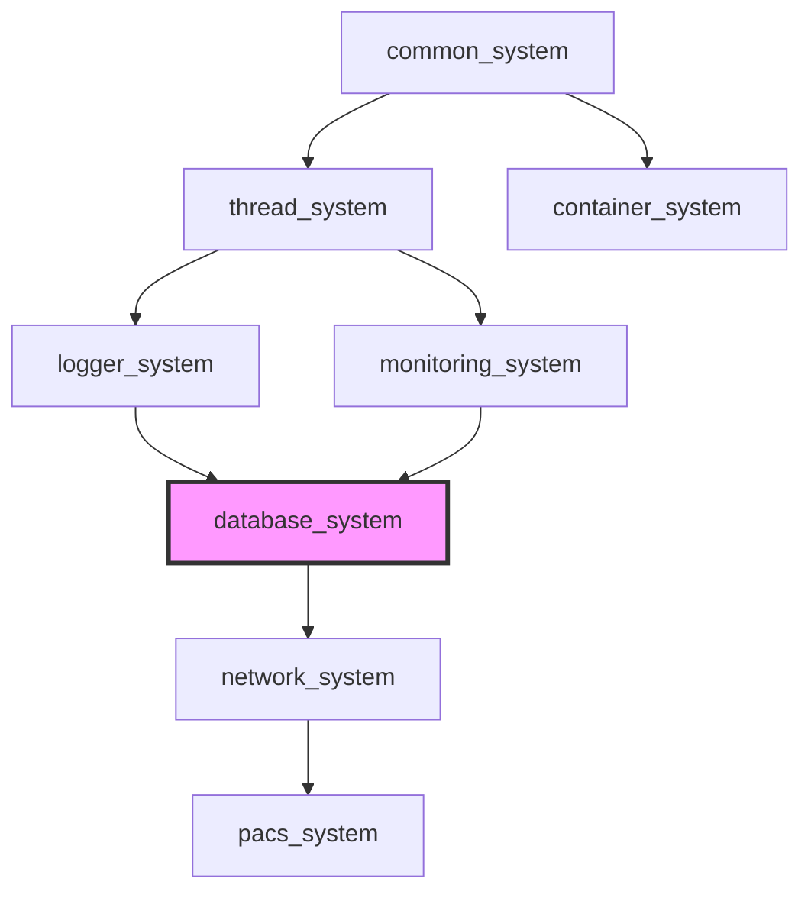

# Database System Architecture

> **SSOT**: This document is the single source of truth for **Database System Architecture**.

> **Language:** **English** | [한국어](ARCHITECTURE.kr.md)

## Table of Contents

- [Overview](#overview)
- [Architecture Layers](#architecture-layers)
- [Core Components](#core-components)
  - [1. Database Abstraction Layer](#1-database-abstraction-layer)
    - [database_base](#database_base)
    - [Backend Implementations](#backend-implementations)
  - [2. Connection Management](#2-connection-management)
    - [database_manager](#database_manager)
    - [Connection Pooling](#connection-pooling)
  - [3. Phase 4 Enterprise Components](#3-phase-4-enterprise-components)
    - [ORM Framework (database/orm/)](#orm-framework-databaseorm)
    - [Performance Monitoring (database/monitoring/)](#performance-monitoring-databasemonitoring)
    - [Security Framework (database/security/)](#security-framework-databasesecurity)
    - [Async Operations (database/async/)](#async-operations-databaseasync)
- [Design Principles](#design-principles)
  - [1. SOLID Principles](#1-solid-principles)
  - [2. Modern C++ Best Practices](#2-modern-c-best-practices)
  - [3. Enterprise Patterns](#3-enterprise-patterns)
- [Thread Safety](#thread-safety)
  - [Synchronization Mechanisms](#synchronization-mechanisms)
  - [Thread-Safe Components](#thread-safe-components)
- [Common System Result Integration](#common-system-result-integration)
- [Interop with Other Modules](#interop-with-other-modules)
- [Error Handling](#error-handling)
  - [Exception Safety Guarantees](#exception-safety-guarantees)
  - [Error Propagation](#error-propagation)
- [Performance Characteristics](#performance-characteristics)
  - [Connection Pool](#connection-pool)
  - [Query Execution](#query-execution)
  - [Memory Management](#memory-management)
- [Scalability](#scalability)
  - [Horizontal Scaling](#horizontal-scaling)
  - [Vertical Scaling](#vertical-scaling)
- [Monitoring and Observability](#monitoring-and-observability)
  - [Metrics Collection](#metrics-collection)
  - [Export Formats](#export-formats)
- [Future Extensions](#future-extensions)
  - [Planned Features](#planned-features)
  - [Extension Points](#extension-points)
- [Dependencies](#dependencies)
  - [Required Libraries](#required-libraries)
  - [Optional Dependencies](#optional-dependencies)
- [Build Configuration](#build-configuration)
  - [CMake Options](#cmake-options)
  - [Compilation Features](#compilation-features)

This document describes the architecture and design patterns of the Database System Phase 4 implementation.

## Overview

> **Cross-reference**:
> [API Reference](./API_REFERENCE.md) — Database backend, query builder, and ORM APIs
> [Benchmarks](./BENCHMARKS.md) — Connection pool and query performance data
> [Backends Guide](./BACKENDS.md) — PostgreSQL, SQLite, MongoDB, and Redis backend details
> [Adapter Patterns](./ADAPTER_PATTERNS.md) — Backend-agnostic adapter implementations

> **Ecosystem reference**:
> [common_system API](https://github.com/kcenon/common_system/blob/main/docs/API_REFERENCE.md) — Result&lt;T&gt; and IExecutor interfaces
> [thread_system Architecture](https://github.com/kcenon/thread_system/blob/main/docs/ARCHITECTURE.md) — Thread pool for async database operations
> [container_system API](https://github.com/kcenon/container_system/blob/main/docs/API_REFERENCE.md) — Data serialization for database records
> [monitoring_system Architecture](https://github.com/kcenon/monitoring_system/blob/main/docs/ARCHITECTURE.md) — Performance monitoring integration

The Database System is designed as a modular, enterprise-grade database abstraction layer that provides unified access to multiple database backends with advanced features for production environments.

## Architecture Layers

```
┌─────────────────────────────────────────────────────────────┐
│                    Application Layer                        │
├─────────────────────────────────────────────────────────────┤
│  ORM Framework  │ Security Layer │ Async Operations        │
├─────────────────────────────────────────────────────────────┤
│                Performance Monitoring                       │
├─────────────────────────────────────────────────────────────┤
│                   Query Builders                           │
├─────────────────────────────────────────────────────────────┤
│                  Connection Pooling                        │
├─────────────────────────────────────────────────────────────┤
│                    Database Manager                        │
├─────────────────────────────────────────────────────────────┤
│                   Database Backends                         │
│      PostgreSQL │ SQLite │ MongoDB │ Redis                │
└─────────────────────────────────────────────────────────────┘
```

## Core Components

### 1. Database Abstraction Layer

#### database_base
The abstract base class that defines the common interface for all database backends.

```cpp
class database_base {
public:
    virtual database_types database_type() = 0;
    virtual bool connect(const std::string& connect_string) = 0;
    virtual bool execute_query(const std::string& query_string) = 0;
    virtual database_result select_query(const std::string& query_string) = 0;
    // ... other virtual methods
};
```

**Design Patterns Used:**
- **Strategy Pattern**: Each database backend implements the same interface
- **Template Method Pattern**: Common operations defined in base class
- **RAII**: Automatic resource management for connections

#### Backend Implementations
- `postgres_manager`: PostgreSQL backend using libpqxx
- `sqlite_manager`: SQLite backend using sqlite3
- `mongodb_manager`: MongoDB backend using mongocxx
- `redis_manager`: Redis backend using hiredis
### 2. Connection Management

#### database_manager
Singleton manager that handles database connections and mode switching.

```cpp
class database_manager {
public:
    static database_manager& handle();
    bool set_mode(database_types db_type);
    bool connect(const std::string& connection_string);
    // ... database operations
};
```

**Design Patterns Used:**
- **Singleton Pattern**: Global access point
- **Factory Pattern**: Creates appropriate database backends
- **Command Pattern**: Encapsulates database operations

#### Connection Pooling
Enterprise-grade connection pooling with adaptive sizing and monitoring.

```cpp
class connection_pool {
private:
    std::queue<std::unique_ptr<database_base>> available_connections_;
    std::vector<std::unique_ptr<database_base>> active_connections_;
    mutable std::mutex pool_mutex_;
    std::condition_variable pool_condition_;
};
```

**Features:**
- Dynamic connection creation/destruction
- Connection health monitoring
- Thread-safe operations
- Configurable pool sizes
- Connection timeout handling

### 3. Phase 4 Enterprise Components

#### ORM Framework (database/orm/)

**Architecture:**
```
Entity Definition → Metadata Generation → Schema Management → Query Execution
```

**Key Components:**
- `entity_base`: Base class for all ORM entities
- `field_metadata`: Type information and constraints for entity fields
- `entity_metadata`: Complete table schema information
- `query_builder<Entity>`: Type-safe query construction
- `entity_manager`: Schema synchronization and entity lifecycle

**C++20 Features Used:**
- **Concepts**: Type-safe entity definitions
- **Template Metaprogramming**: Compile-time schema validation
- **SFINAE**: Type trait-based field detection

```cpp
template<typename T>
concept Entity = requires(T t) {
    typename T::primary_key_type;
    { t.table_name() } -> std::convertible_to<std::string>;
    { t.get_metadata() } -> std::same_as<const entity_metadata&>;
};
```

#### Performance Monitoring (database/monitoring/)

**Architecture:**
```
Metrics Collection → Aggregation → Alerting → Export (Prometheus)
```

**Components:**
- `performance_monitor`: Core metrics collection and analysis
- `connection_metrics`: Connection pool utilization tracking
- `query_metrics`: Query performance statistics
- `performance_alert`: Configurable alerting system

**Thread Safety:**
- Atomic counters for high-frequency metrics
- Mutex protection for complex data structures
- Lock-free data structures where possible

#### Security Framework (database/security/)

**Multi-layered Security:**
```
Application → Authentication → Authorization → Audit → Encryption
```

**Components:**
- `credential_manager`: Secure credential storage with encryption
- `access_control`: Role-based access control (RBAC)
- `audit_logger`: Comprehensive security event logging
- `security_monitor`: Real-time threat detection
- `query_security`: SQL injection prevention

**Security Features:**
- Master key encryption for credentials
- Session management with timeout
- Audit trail with tamper detection
- Threat pattern recognition

#### Async Operations (database/async/)

**Async Architecture:**
```
std::future → C++20 Coroutines → Stream Processing
```

**Components:**
- `async_executor`: Thread pool for async operations
- `async_database`: Async wrapper for database operations
- `database_awaitable`: C++20 coroutine support
- `stream_processor`: Real-time data streaming

**Concurrency Patterns:**
- **Actor Model**: Message-passing for async operations
- **Future/Promise**: Async result handling
- **Coroutines**: Modern async programming

## Design Principles

### 1. SOLID Principles
- **S**: Single Responsibility - Each class has one reason to change
- **O**: Open/Closed - Extensible without modification
- **L**: Liskov Substitution - Interchangeable database backends
- **I**: Interface Segregation - Focused interfaces
- **D**: Dependency Inversion - Depend on abstractions

### 2. Modern C++ Best Practices
- **RAII**: Automatic resource management
- **Smart Pointers**: Memory safety
- **Move Semantics**: Performance optimization
- **Constexpr**: Compile-time computation
- **Template Metaprogramming**: Type safety

### 3. Enterprise Patterns
- **Layered Architecture**: Clear separation of concerns
- **Plugin Architecture**: Extensible database backends
- **Event-Driven Architecture**: Async operations and monitoring
- **Microservices Ready**: Lightweight DAL for service integration

## Thread Safety

### Synchronization Mechanisms
1. **std::mutex**: Protecting shared state
2. **std::atomic**: Lock-free counters and flags
3. **std::condition_variable**: Thread coordination
4. **std::shared_mutex**: Reader-writer locks for read-heavy operations

### Thread-Safe Components
- All database operations are thread-safe
- Connection pool supports concurrent access
- Performance monitoring uses atomic operations

## Common System Result Integration

- Compile-time optional integration with `common_system` Result types.
- Define `DATABASE_USE_COMMON_SYSTEM` to enable `common::Result<T>`/`common::VoidResult` wrappers:
  - `connect_result(const std::string&)`
  - `disconnect_result()`
  - `create_query_result(const std::string&)`
- Benefits: exception-free error propagation, standardized error_info.

## Interop with Other Modules

- With `container_system`: use containers for typed serialization between app and DB layers when applicable.
- Security audit logging is thread-safe

## Error Handling

### Exception Safety Guarantees
1. **No-throw**: Performance-critical operations
2. **Strong**: Transactional operations
3. **Basic**: Resource cleanup guaranteed

### Error Propagation
```cpp
// Database operations return status
bool success = db.execute_query("INSERT ...");

// Critical errors throw exceptions
try {
    auto result = db.select_query("SELECT ...");
} catch (const database_exception& e) {
    // Handle database-specific errors
}
```

## Performance Characteristics

### Connection Pool
- **O(1)** connection acquisition/release
- **Configurable** pool sizing based on load
- **Adaptive** connection creation/destruction

### Query Execution
- **Prepared statements** for SQL databases
- **Connection reuse** to minimize overhead
- **Bulk operations** for improved throughput

### Memory Management
- **Object pooling** for frequently created objects
- **Smart pointers** for automatic cleanup
- **Move semantics** to minimize copying

## Scalability

### Horizontal Scaling
- **Multi-backend support** with unified interface
- **Connection pooling** per database instance
- **Async operations** for non-blocking I/O

### Vertical Scaling
- **Thread pool** sizing based on hardware
- **Lock-free data structures** where possible
- **Memory-efficient** data structures

## Monitoring and Observability

### Metrics Collection
- Query execution times and counts
- Connection pool utilization
- Error rates and types
- Security events and threats

### Export Formats
- **Prometheus**: Time-series metrics
- **JSON**: REST API endpoints
- **Logs**: Structured logging output

## Future Extensions

### Planned Features
- **GraphQL Support**: Modern query interface
- **Caching Layer**: Redis-based query caching
- **Schema Migrations**: Automated database versioning
- **Multi-tenant Support**: Tenant isolation

### Extension Points
- **Custom Database Backends**: Implement `database_base`
- **Custom Security Providers**: Implement security interfaces
- **Custom Metrics Exporters**: Extend monitoring system
- **Custom Query Languages**: Extend query builders

## Dependencies

### Required Libraries
- **C++20 Standard Library**: Core functionality
- **Database Client Libraries**: Backend-specific (optional)
- **OpenSSL**: Encryption and TLS support

### Optional Dependencies
- **libpqxx**: PostgreSQL support
- **sqlite3**: SQLite support
- **mongocxx**: MongoDB support
- **hiredis**: Redis support

## Ecosystem Dependencies

database_system sits at **Tier 3** in the kcenon ecosystem, providing database abstraction.



> **Ecosystem reference**:
> [common_system](https://github.com/kcenon/common_system) — Tier 0: Result&lt;T&gt;, IExecutor
> [thread_system](https://github.com/kcenon/thread_system) — Tier 1: Async operations (optional)
> [container_system](https://github.com/kcenon/container_system) — Tier 1: Data serialization (optional)
> [monitoring_system](https://github.com/kcenon/monitoring_system) — Tier 3: Performance monitoring (optional)
> [network_system](https://github.com/kcenon/network_system) — Tier 4: Transport layer (consumer)
> [pacs_system](https://github.com/kcenon/pacs_system) — Tier 5: DICOM database (consumer)

---

## Build Configuration

### CMake Options
```cmake
option(ENABLE_POSTGRESQL "Enable PostgreSQL support" ON)
option(ENABLE_SQLITE "Enable SQLite support" OFF)
option(ENABLE_MONGODB "Enable MongoDB support" OFF)
option(ENABLE_REDIS "Enable Redis support" OFF)
```

### Compilation Features
- **Header-only**: Core components
- **Optional linking**: Database client libraries
- **Mock implementations**: Testing without databases

---

This architecture provides a solid foundation for database applications with modern C++ features, comprehensive security, and performance monitoring.

---

*Last Updated: 2025-10-20*
